<!-- author: uncletientrung -->
- [Giới thiệu đề tài](#đề-tài-hệ-thống-quản-lý-tồn-kho-quần-áo)
- [Thành viên & Đóng góp](#thành-viên--đóng-góp)
- [Cài đặt & Chạy chương trình](#getting-started)
- [Tài khoản sử dụng](#tài-khoản-admin)
- [Giao diện hệ thống](#giao-diện)

# Đồ án môn lập trình C#  
## Đề tài: Hệ thống quản lý tồn kho quần áo

## Thành viên & Đóng góp
| Thành viên | MSSV | Vai trò | Đóng góp | 
|----|------|--------|----------|----------|
|  Nguyễn Tiến Trung | 3123410396 | Nhóm trưởng | 26% |
|  Nguyễn Minh Thuận | 3123410365 | Thành viên | 20% |
|  Trương Minh Vũ | 3123410437 | Thành viên | 18% |
|  Vũ Ngọc Tùng | 3123410418 | Thành viên | 18% |
|  Phan Thanh Tùng | 3123410417 | Thành viên | 18% |

## Công nghệ sử dụng
- Ngôn ngữ: C#
- Giao diện: Windows Forms
- Database: MySQL
- Công cụ: XAMPP, Visual Studio

## Getting Started
1. Yêu cầu môi trường
    - .NET Framework 4.8
    - XAMPP
    - Visual Studio
2. Tải source code về:
    ```bash
   git clone https://github.com/uncletientrung/QuanLyKho_CSharp.git
   ```
3. Mở xampp và vào trang http://localhost/phpmyadmin/ tạo 1 database mới có tên là quanlikhoquanaom và import cơ sở dữ liệu trong folder QuanLyKho_CSharp -> Database -> file quanlikhoquanaom.sql trong source code.
4. Chạy chương trình:
    - Clone thư viện giao diện Krypton Toolkit:
    https://github.com/ComponentFactory/Krypton
    - Thêm reference thư viện Krypton vào project `QuanLyKho_CSharp`, `QuanLyKho.DAO`, `QuanLyKho.BUS`, `QuanLyKho.DTO`
    (Add Reference các file DLL cần thiết như hình bên dưới)
    <table align="center" border="5" cellpadding="10" cellspacing="0">
        <tr>
            <td>
                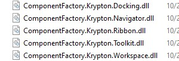
            </td>
        </tr>
    </table>

## Tài khoản sử dụng
### Tài khoản Admin
- Username: admin
- Password: 123
### Tài khoản nhân viên
- Username: nv
- Password: 123
### Tài khoản quản lý kho
- Username: qlk
- Password: 123

## Giao diện
<table align="center" border="5" cellpadding="10" cellspacing="0">
  <tr>
    <td>
      
    </td>
  </tr>
</table>
<h4 align="center">Đăng nhập</h4>

<table align="center" border="5" cellpadding="10" cellspacing="0">
  <tr>
    <td>
      
    </td>
  </tr>
</table>
<h4 align="center">Trang chủ</h4>

<table align="center" border="5" cellpadding="10" cellspacing="0">
  <tr>
    <td>
      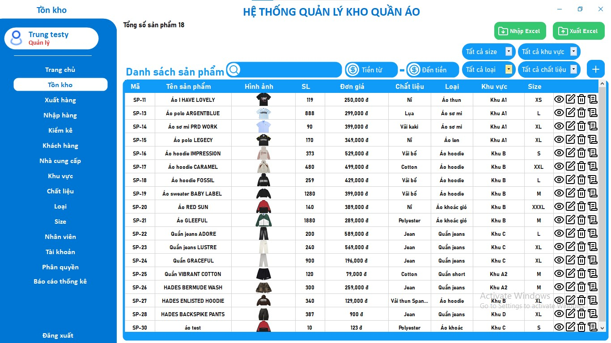
    </td>
  </tr>
</table>
<h4 align="center">Quản lý tồn kho</h4>

<table align="center" border="5" cellpadding="10" cellspacing="0">
  <tr>
    <td>
      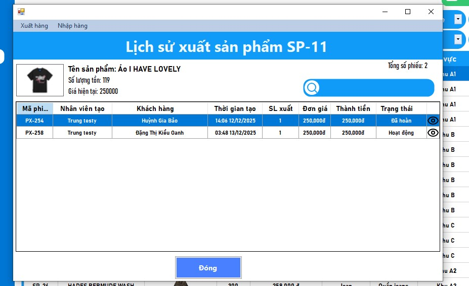
    </td>
  </tr>
</table>
<h4 align="center">Lịch sử nhập xuất sản phẩm</h4>

<table align="center" border="5" cellpadding="10" cellspacing="0">
  <tr>
    <td>
      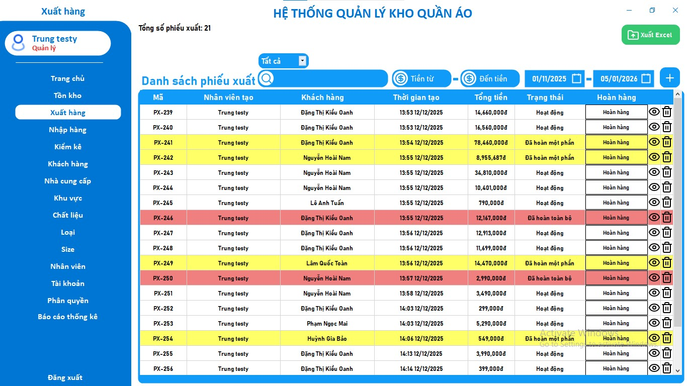
    </td>
  </tr>
</table>
<h4 align="center">Quản lý phiếu xuất</h4>

<table align="center" border="5" cellpadding="10" cellspacing="0">
  <tr>
    <td>
      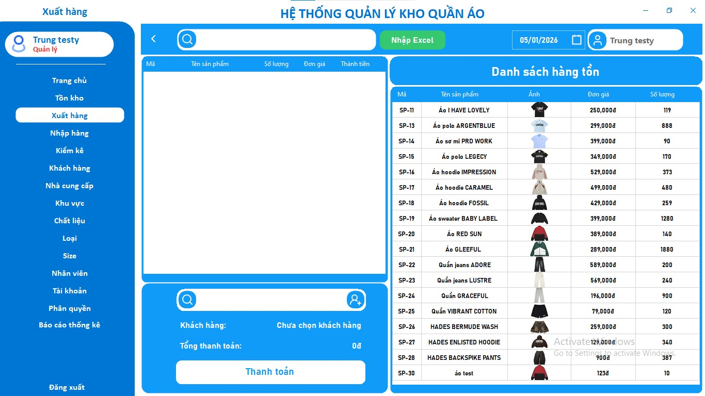
    </td>
  </tr>
</table>
<h4 align="center">Thêm phiếu xuất</h4>

<table align="center" border="5" cellpadding="10" cellspacing="0">
  <tr>
    <td>
      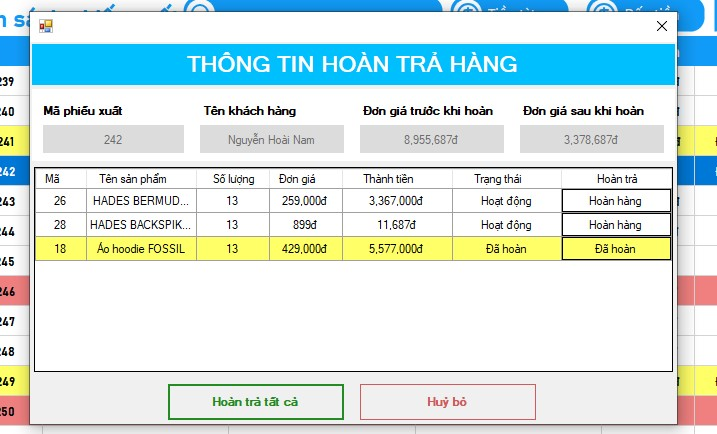
    </td>
  </tr>
</table>
<h4 align="center">Quản lý hoàn hàng</h4>

<table align="center" border="5" cellpadding="10" cellspacing="0">
  <tr>
    <td>
      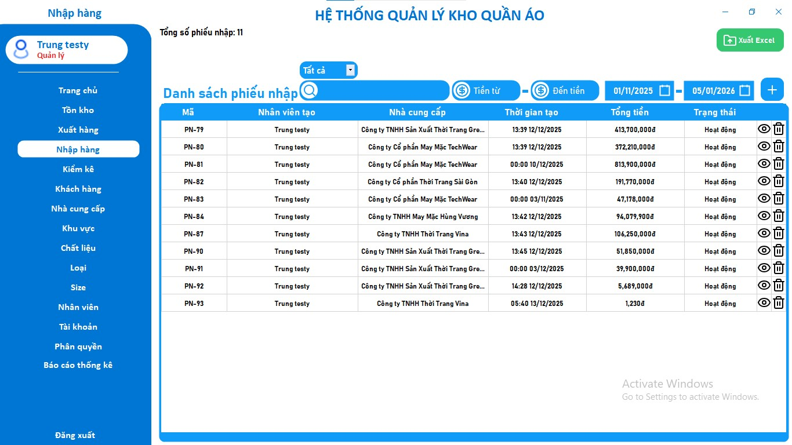
    </td>
  </tr>
</table>
<h4 align="center">Quản lý nhập hàng</h4>

<table align="center" border="5" cellpadding="10" cellspacing="0">
  <tr>
    <td>
      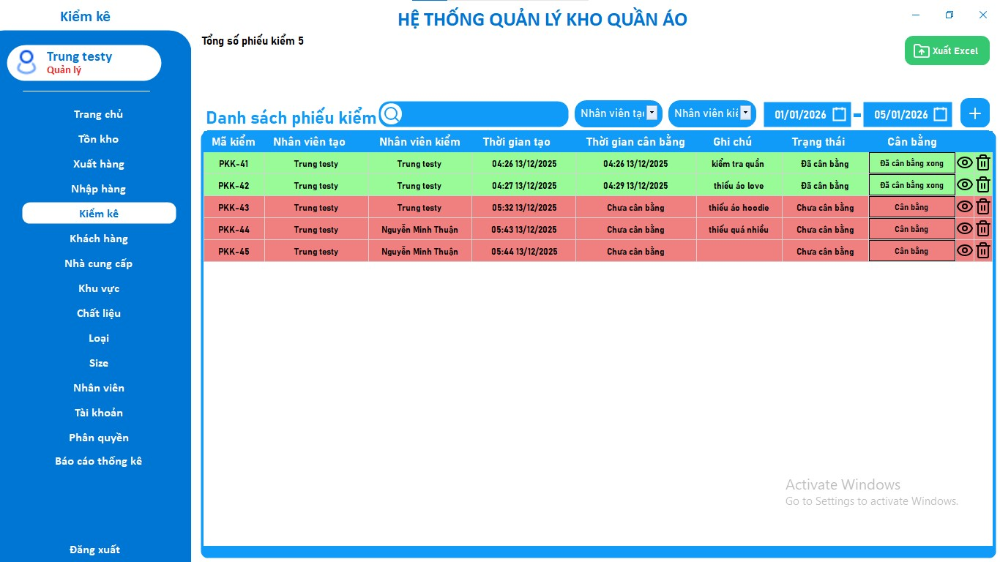
    </td>
  </tr>
</table>
<h4 align="center">Quản lý kiểm kê</h4>

<table align="center" border="5" cellpadding="10" cellspacing="0">
  <tr>
    <td>
      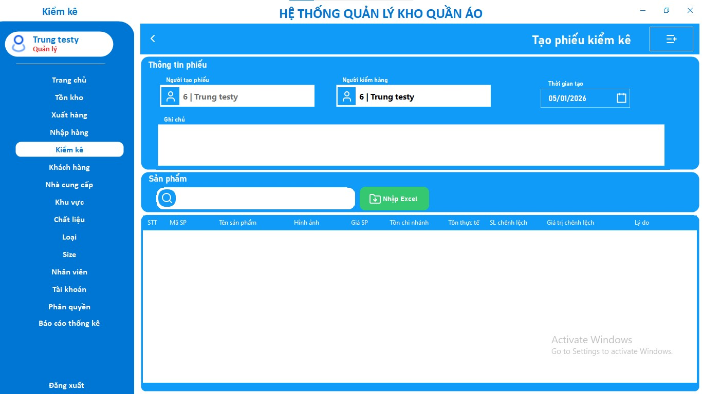
    </td>
  </tr>
</table>
<h4 align="center">Thêm phiếu kiểm kê</h4>

<table align="center" border="5" cellpadding="10" cellspacing="0">
  <tr>
    <td>
      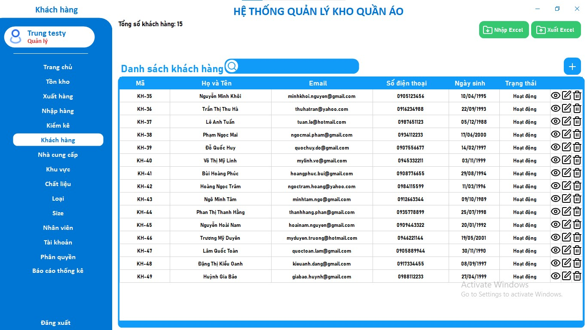
    </td>
  </tr>
</table>
<h4 align="center">Quản lý các thuộc tính</h4>

<table align="center" border="5" cellpadding="10" cellspacing="0">
  <tr>
    <td>
      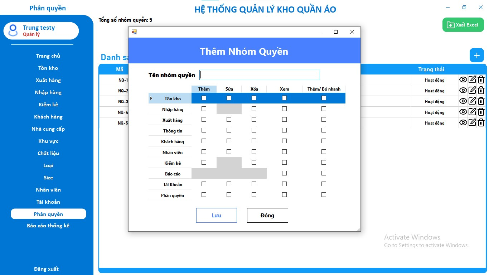
    </td>
  </tr>
</table>
<h4 align="center">Thêm phân quyền</h4>

<table align="center" border="5" cellpadding="10" cellspacing="0">
  <tr>
    <td>
      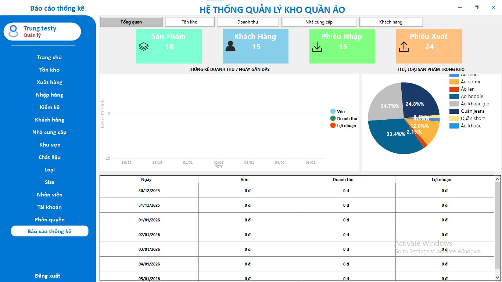
    </td>
  </tr>
</table>
<h4 align="center">Quản lý báo cáo thông kê</h4>
